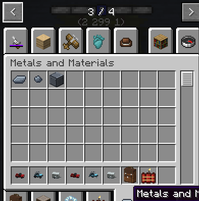

The pack's one **steel**: an ingot, a nugget and a block. Every mod that needs steel takes this
one, so steel from anywhere works in any recipe.

| Item | Recipe |
|---|---|
| **Steel Ingot** | three iron ingots and a piece of coal (or charcoal) make **three** |
| **Steel Nugget** | an ingot makes nine; nine make an ingot |
| **Block of Steel** | nine ingots; back to nine. Mine it with a stone pickaxe or better |

All three are in the **Metals and Materials** creative tab, and next to iron's ingot, nugget and
block in the vanilla tabs.

## What uses it

- [Ranged Weapons Mod](/wiki/ranged-weapons-mod): the guns' parts, magazines, the weapons workbench,
  the rocket launcher.
- [Vanilla Wheels](/wiki/vanilla-wheels): wheels, engines, garage door panels, repairs on the
  Mechanic Lift.
- The vehicles: the [Trailblazer](/wiki/trailblazer)'s chassis (nine blocks of steel) and the
  [Trailer](/wiki/trailer)'s.
